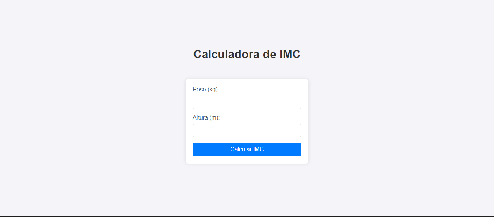

# Título do Projeto

🎓 Desafio Aceito e Superado! 🚀

Recentemente, fui desafiado na faculdade a desenvolver um código em C++ para calcular o IMC (Índice de Massa Corporal) de uma pessoa. Aceitei o desafio e consegui criar o código com sucesso. 💻

Mas não parei por aí! Percebi que poderia transformar essa solução em algo ainda mais acessível e amigável. Decidi então criar uma página web utilizando HTML, CSS e JavaScript. O resultado foi uma interface intuitiva e fácil de usar, que facilita o cálculo do IMC para qualquer pessoa. 🌐✨

  

## Demonstração
 
  
  
<a href="https://meuimc.vercel.app/">🔗 Veja o projeto clicando aqui !
</a>

  
## 🛠 Tecnnologias Utilizadas

  

## 🔗 Links

## Screenshots

